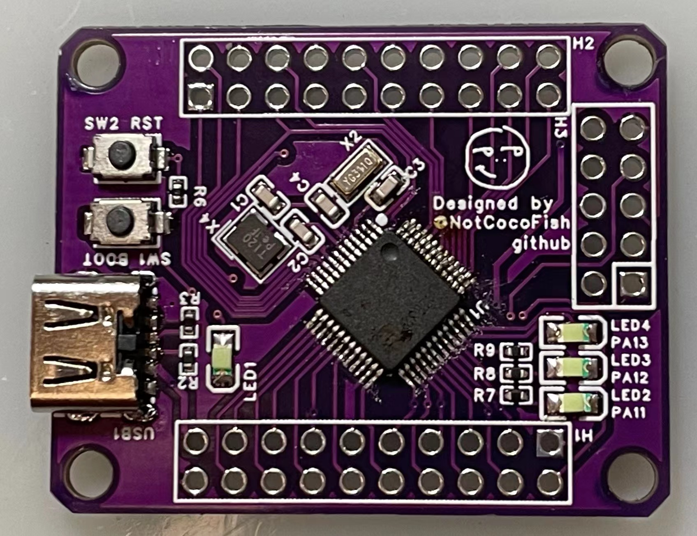
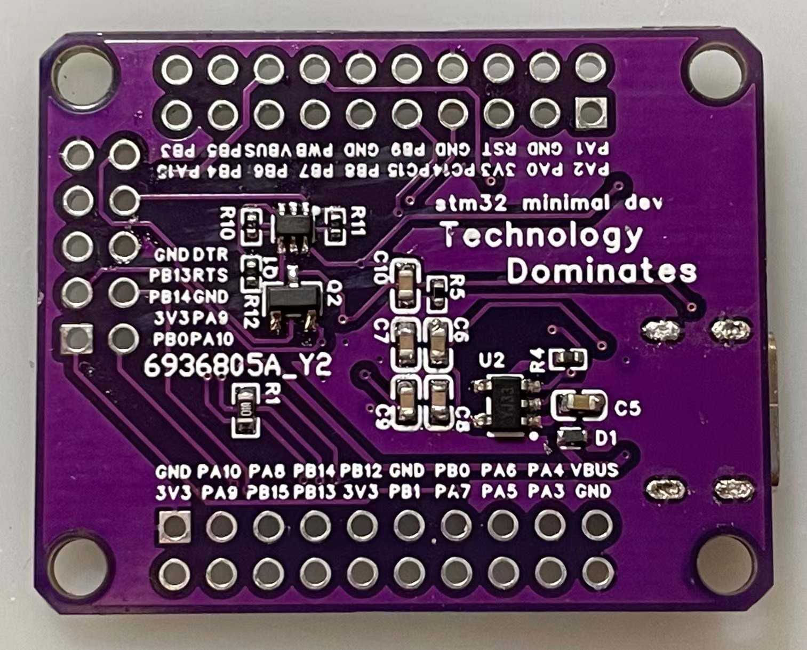
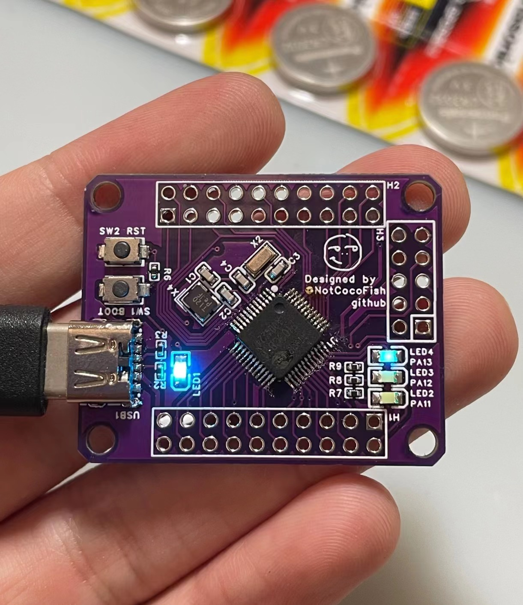

# Air32_MiniDevBoard

An Air32 board designed by me, with 40 available pins, usb-powering, and auto-burning circuit.

## Gerber and Simulation

This project is implemented by 嘉立创EDA.

### Gerber Pictures

  

### Simulation Pictures

## Functions

### Actual Appearance

 

### Voltage Regulator Circuit

As can be seen from the picture, when powered with 5 volts, the power led is lit, and is much brighter than 

the other led.

